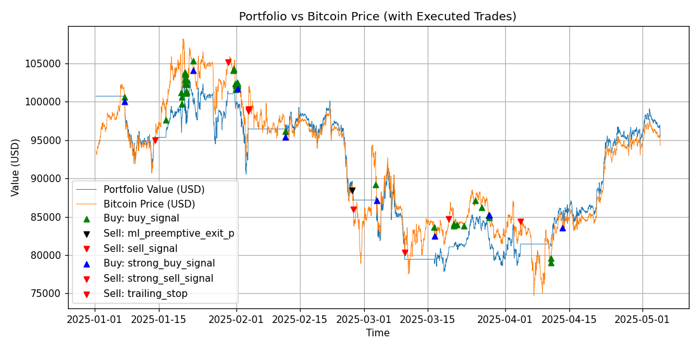

# PyCoinTrader

Prototype BTC/USD trading bot using **RSI**, **SMA**, and a small **ML** model.  
It trains on historical data, simulates out-of-sample trades, and benchmarks vs buy-and-hold BTC.



> **Note:** This is a research toy. In most runs it underperforms HODL; the goal is to show a clean, reproducible pipeline.

---

## ✨ What’s inside

```
scripts/                 # entrypoints you run
  download_history_data.py  # fetch BTC/USD bars from Alpaca (optional)
  train_models.py           # train ML buy/sell models
  run_simulate.py           # simulate trading on evaluation data
  plot_performance.py       # render chart(s) from a run’s data.pkl
  pl_ratio.py               # print outperformance vs BTC from decision_log.jsonl
  clean_output.sh           # wipe data/outputs/*
  clean_src.sh              # safe repo cleanup (dry-run by default)

src/trader/              # core library (signals, ML, sim, plotting)
config/config.json       # strategy/config params
data/input/              # example inputs (already included)
  train_data.json
  simu_data.json
data/outputs/            # run outputs go here (numbered 1/, 2/, ...)
extra_scripts/           # helpers (optional)
models/                  # trained models are written here
```

---

## 🧰 Requirements

- Python 3.10+  
- Install dependencies:

```bash
pip install pandas numpy matplotlib scikit-learn xgboost joblib requests
```

---

## 🔑 API keys (only needed if you fetch fresh data)

`scripts/alpaca_config.py` reads **environment variables**:

```bash
export API_KEY_ID="your_alpaca_key"
export API_SECRET_KEY="your_alpaca_secret"
```

(You can also hardcode them in `scripts/alpaca_config.py`, but env vars are safer.)

---

## 🚀 Quickstart (uses the included example data)

Run these from **inside the `scripts/` directory**:

```bash
cd scripts
# 1) Train models on training set
python train_models.py ../data/input/train_data.json

# 2) Simulate on the evaluation set
python run_simulate.py ../data/input/simu_data.json
```

This creates a new numbered folder under `../data/outputs/` (e.g. `../data/outputs/1/`) containing:
- `data.pkl` — time series + trades for plotting
- `decision_log.jsonl` — per-bar log
- summary/metrics files and CSVs

**Plot the performance chart** for that run:

```bash
# replace 1 with the run folder you just created
python plot_performance.py ../data/outputs/1/data.pkl
```

**Print outperformance vs BTC** for that run:

```bash
python pl_ratio.py ../data/outputs/1/decision_log.jsonl
# (with no argument it defaults to ../data/outputs/1/decision_log.jsonl)
```

**Clean outputs** (optional):

```bash
./clean_output.sh
```

---

## 📥 Fetch fresh data (optional)

If you have an Alpaca key, you can pull your own bars and create new splits.

```bash
cd scripts
# Saves to ../data/input/data.json if no path given
python download_history_data.py               # default outfile
python download_history_data.py ../data/input/my_data.json
```

---

## ⚙️ Config & models

- Strategy/ML parameters live in `config/config.json`.
- Trained models are saved under `models/` (paths are read from `config/config.json`).
- Output runs are created in `data/outputs/<run_id>/` (auto-numbered).

---

## 🧹 Maintenance

Preview a safe cleanup of caches and build junk (dry-run):

```bash
cd scripts
./clean_src.sh
# actually delete matched files/dirs
./clean_src.sh --apply
```

---

## ⚠️ Disclaimer

This code is for **research/education**. It is **not** financial advice and not intended for live trading.  
Out-of-sample results generally **do not** beat buy-and-hold BTC.
